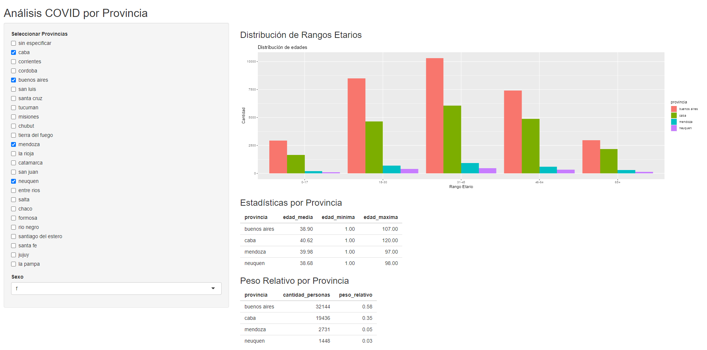

# MiniProyecto-COVID
Ejercicio práctico en Shiny para explorar datos COVID-19 por provincia en Argentina

# Análisis COVID por Provincia

[](https://shiny.rstudio.com/)

---

## 📋 Descripción

Esta aplicación **Shiny** permite analizar datos COVID-19 por provincia en Argentina.  
- Limpia variables de edad y fecha.  
- Filtra por provincia(s) y sexo.  
- Muestra distribución de rangos etarios, estadísticas descriptivas y peso relativo.  

---

## 🚀 Instalación

1. Clona este repositorio:
   ```bash
   git clone https://github.com/tu-usuario/tu-repo.git
   cd tu-repo
   ```
   
Instala dependencias en R:
```
install.packages(c("shiny", "tidyverse", "stringi", "lubridate"))
```

Ejecuta la aplicación:
```
library(shiny)
runApp("app.R")
```
## 🎮 Uso
Selecciona una o varias provincias.

Elige genero (f o m).

Observa los gráficos y tablas que se actualizan en tiempo real.

Si no seleccionas ninguna provincia, verás un mensaje de aviso.

## 📂 Estructura de archivos
bash
```
├── Basecovid.txt       # Datos brutos
├── app.R      # Código fuente de la app
├── README.md           
```
